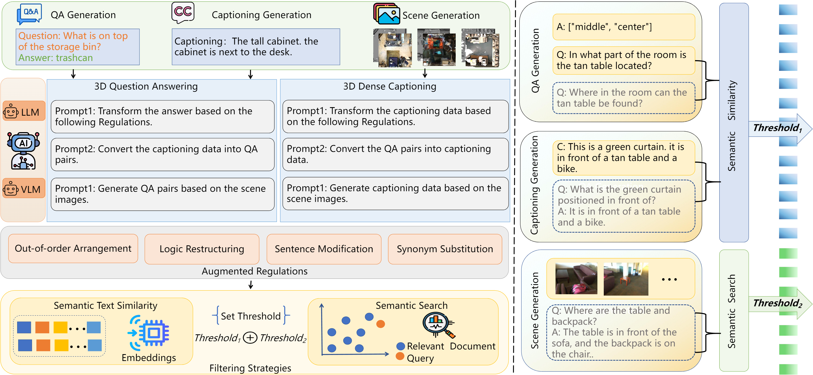

<div align= "center">
    <h1> Official repo for 3D-MoRe 🐱‍💻</h1>
</div>

<div align="center">
    <h2> <a href="/">3D-MoRe: Unified Modal-Contextual Reasoning for Embodied Question Answering</a></h2>

</div>


## 📑 Introduction 3D-MoRe

3D-MoRe is a novel framework designed to generate large-scale 3D-language datasets by leveraging foundational models. It integrates multi-modal embedding, cross-modal interaction, and a language model decoder to process natural language instructions and 3D scene data, enhancing reasoning capabilities in complex 3D environments.




## 🚩 News
- 2025-06-16. 🎉 3D-MoRe is accepted by IROS 2025!
- 2024-09-15. 📣 Upload paper and init project

## ⚡ Start

<details>
  <summary><b>Environment Setup</b></summary>

1. **Install Dependencies**  
   - Python 3.8.16 + CUDA 11.6
   - Core packages: `h5py scipy cython 'trimesh<2.35.40' 'networkx<2.3' 'torch=1.13.1+cu116' 'transformers>=4.37.0'`
   - Build extensions:
     ```bash
     cd third_party/pointnet2 && python setup.py install
     cd utils && python cython_compile.py build_ext --inplace
     ```

2. **Download BERT Embeddings**  
   Get weights from [HuggingFace](https://huggingface.co/CH3COOK/bert-base-embedding) to `./bert-base-embedding`

</details>

<details>
  <summary><b>Data Preparation</b></summary>

1. **ScanNet 3D Data**  
   - Download preprocessed data: [scannet_data.zip](https://huggingface.co/CH3COOK/LL3DA-weight-release/blob/main/scannet_data.zip)  

2. **Language Annotations**  
   - Required datasets:  
     - ScanRefer: [Source](https://github.com/daveredrum/ScanRefer)  
     - Nr3D: [Official](https://referit3d.github.io/#dataset) + [Preprocessing](https://github.com/ch3cook-fdu/Vote2Cap-DETR/blob/master/data/parse_nr3d.py)  
     - ScanQA: [Guide](https://github.com/ATR-DBI/ScanQA/blob/main/docs/dataset.md)  
     - 3D-LLM: [Directory](./data/3D_LLM) + [Script](./data/3D_LLM/pre-process-3D-LLM.py)  
   - Folder structure:
     ```
     ./data/{ScanRefer,Nr3D,ScanQA,3D_LLM}/
       └── {dataset-specific}.json
     ```

3. **Pre-trained LLM Weights (Optional)**  
   Download `opt-1.3b` from HuggingFace to `./facebook/opt-1.3b` (include `config.json`, `pytorch_model.bin` etc.)

</details>

<details>
<summary><b>💻 Model Training</b></summary>


Reproduce paper results with `scripts-v0`:
```bash
bash scripts/opt-1.3b/train.generalist.sh
```
</details>

<details>
  <summary><b>Training/Tuning Commands</b></summary>

- **Generalist Training**  
  ```bash
  bash scripts/opt-1.3b/train.generalist.sh  # Weights on [HuggingFace](https://huggingface.co/CH3COOK/LL3DA-weight-release)
  ```
- **Task-specific Tuning**  
  ```bash
  # ScanQA QA / ScanRefer&Nr3D Captioning / Open-vocab Detection
  bash scripts/opt-1.3b/tuning.{scanqa,scanrefer,nr3d,ovdet}.sh
  ```
</details>

<details>
  <summary><b>Evaluation Commands</b></summary>

```bash
# Generalist / ScanQA / ScanRefer&Nr3D
bash scripts/opt-1.3b/eval.{generalist,scanqa,scanrefer,nr3d}.sh
```

</details>

<details>
<summary><b>Dataset Download</b></summary>

[Dataset Download](https://drive.google.com/drive/folders/19WK7oy3kJtbEHhQFSDXVySfvKA_ifsAG?usp=drive_link)
</details>

## Acknowledgments

Thanks to [Vote2Cap-DETR](https://github.com/ch3cook-fdu/Vote2Cap-DETR), [3D-LLM](https://github.com/UMass-Foundation-Model/3D-LLM), [Scan2Cap](https://github.com/daveredrum/Scan2Cap), and [3DETR](https://github.com/facebookresearch/3detr), and [LL3DA](https://ll3da.github.io/), We borrow some of their codes and data.


## 📖 Citation
```bibtex
@misc{xu20253dmoreunifiedmodalcontextualreasoning,
  title={3D-MoRe: Unified Modal-Contextual Reasoning for Embodied Question Answering}, 
  author={Xu, Rongtao and Gao, Han and Yu, Mingming and An, Dong and Chen, Shunpeng and Wang, Changwei and Guo, Li and Liang, Xiaodan and Xu, Shibiao},
  year={2025},
  eprint={2507.12026},
  primaryClass={cs.CV}
}
```

## ✨ Star History

[](https://star-history.com/#gaohan-cmd/3D-MoRe&Date)
## License

This code is distributed under an [MIT LICENSE](LICENSE). If there are any problem regarding our paper and code, feel free to open an issue!
